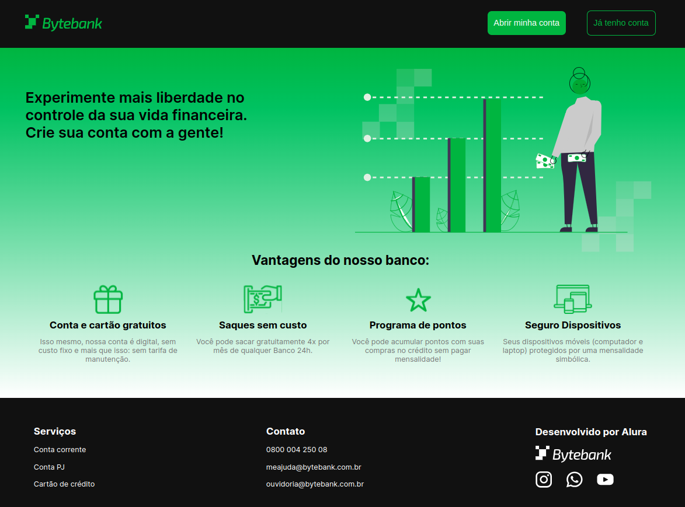

# Project

This project is based on the Alura courses on cypress e2e tests. The application under test (Bytebank) is a simple digital bank app with basic features and pages, such as:

- Landing page
- Homepage
  - Cards page
  - Services page
  - Investments page
- Not found page
- My account page

[Here's the app's Figma prototype](https://www.figma.com/file/YJydxY5H8gf5lPLyKWOBbY?embed_host=notion&kind=&node-id=80%3A199&t=rKQJYFpJUumrCTx1-1&viewer=1).

## Running the app
On the api-bytebank-v2 folder, execute:
 `npm install` 
 and then `npm run dev`

On the project root, execute :
`npm install` 
and then 
`npm run start`

The application will be running at <a href="http://localhost:3000/">http://localhost:3000/</a>.

## Running the e2e tests
To access the cypress dashboard:
`npx cypress open`

or to run headlessly:
`npx cypress run --browser chrome`

